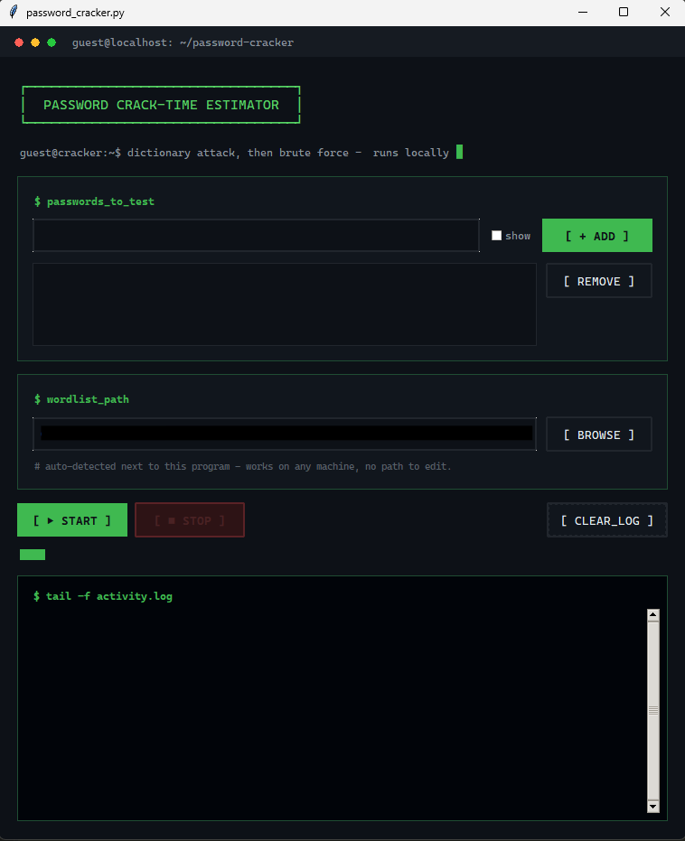
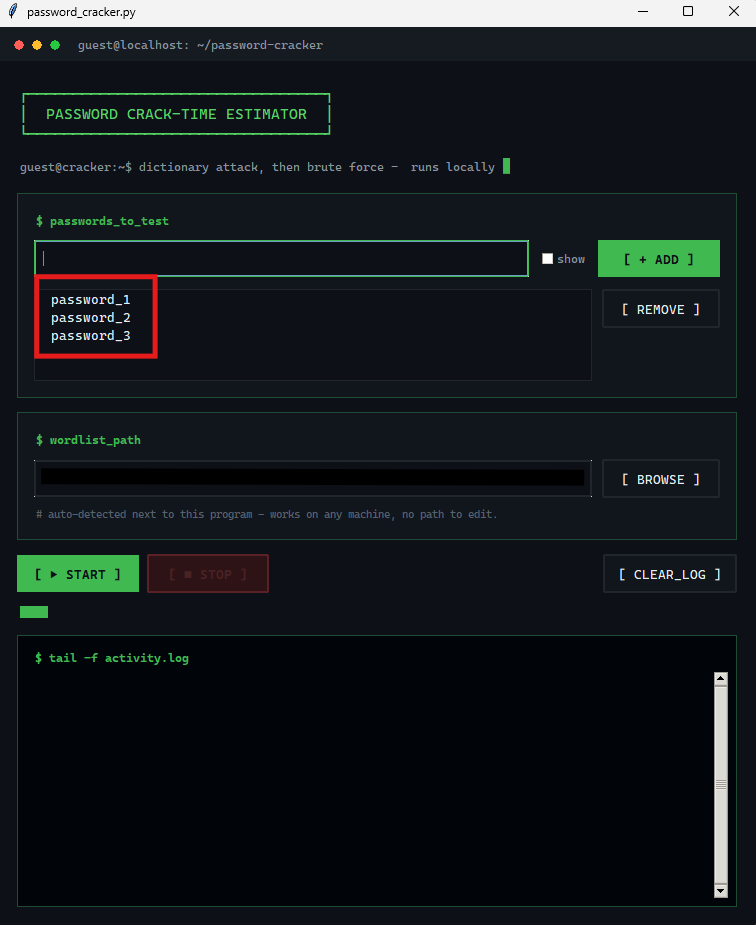
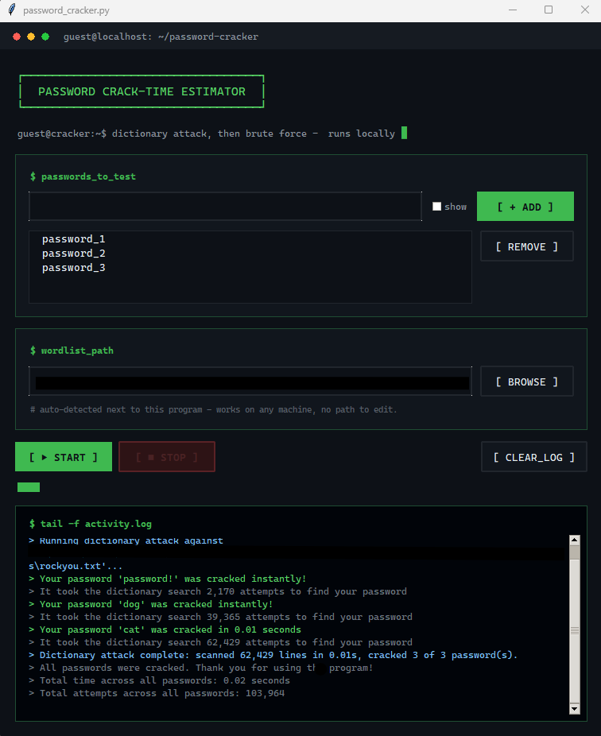

<h1 align="center">Credential Attack Simulation Tool</h1>

<p align="center">
A Python-based cybersecurity tool that simulates password attacks using dictionary and brute-force techniques. Available as both a desktop GUI and command-line application. Avaliable for both Windows and Linux environments.
</p>

<p align="center">

</p>

## Overview

The **Credential Attack Simulation Tool** is an educational password auditing program designed to demonstrate how passwords can be recovered using common credential attack techniques.

The program follows a two-stage attack process:

1. **Dictionary Attack** – Tests the target passwords against a user-provided password wordlist.
2. **Brute-Force Attack** – If a password is not found in the dictionary, the program attempts to generate character combinations until the password is found or the configured length limit is reached.

The tool supports testing up to **100 passwords** at a time and records:

* Number of attempts
* Time elapsed
* Attack method used
* Whether the password was discovered

The brute-force engine can generate combinations using:

* Uppercase letters
* Lowercase letters
* Numbers
* Symbols

Brute-force attacks are limited to passwords of **8 characters or fewer** because the search space becomes extremely large as password length increases. Passwords longer than the limit are reported rather than brute-forced.

## Key Features

* Dictionary-based password attacks
* Automatic fallback to brute force
* Support for multiple passwords
* Attack timing and attempt statistics
* GUI and CLI interfaces using the same core engine
* GUI activity log with color-coded results
* Stop button for cancelling long-running brute-force attacks
* Confirmation before starting potentially long brute-force searches
* User-selectable password dictionaries
* Prebuilt versions available for Windows and Linux

## How It Works

```text
                Start
                  |
                  v
          Select Dictionary
                  |
                  v
           Enter Passwords
                  |
                  v
          Dictionary Attack
                  |
          +-------+-------+
          |               |
       Found          Not Found
          |               |
          v               v
        Result       Brute-Force Attack
                          |
                    +-----+-----+
                    |           |
                  Found      Not Found
                    |           |
                    v           v
                  Result    Report Result
```

## Using the GUI

The GUI is designed for a simple workflow:

1. Launch the program.
2. Click **Browse** and select a password dictionary.
3. Enter one or more passwords to test.
4. Start the attack.
5. Review the results in the activity log.

The example screenshots use **`rockyou.txt` (2024 edition)** as the password dictionary. You can use another newline-separated password list instead.

### Main window

<p align="center">

</p>

### Add passwords for testing

<p align="center">

</p>

### View attack results

<p align="center">

</p>

## Command-Line Interface

The project also includes a command-line version with the same underlying attack logic.

### Launch the program

```bash
python3 password_cracker.py
```

The CLI walks through the password-testing process interactively and displays the attack results and statistics in the terminal.

## Downloads

Prebuilt versions are available for:

* **Windows**
* **Linux**

Download the appropriate release from the repository's **Releases** section if you do not want to run the Python source code directly.

## Running From Source

### Requirements

* Python 3.9 or newer
* `tkinter` for the GUI

On Debian/Ubuntu-based Linux distributions:

```bash
sudo apt install python3-tk
```

Windows Python installations from python.org normally include `tkinter`.

### Run the GUI

```bash
python3 password_cracker_gui.py
```

### Run the CLI

```bash
python3 password_cracker.py
```

The following files make up the core application:

```text
password_cracker.py          # Command-line interface
password_cracker_gui.py      # Desktop GUI
password_cracker_core.py     # Shared attack logic
```

`password_cracker_core.py` must remain available to the GUI and CLI because both interfaces use it for the dictionary attack, brute-force engine, and timing logic.

## Password Dictionaries

The program accepts a user-provided password dictionary.

For example:

```text
rockyou.txt
```

The wordlist should contain one password per line.

The tool does **not** require `rockyou.txt` specifically. Any compatible password dictionary can be selected through the GUI or provided through the CLI workflow.

## Technologies

### Language

* **Python 3.9+**

### Libraries

* Python standard library
* `tkinter` for the desktop GUI

No third-party Python packages are required to run the source code.

### Dataset

* `rockyou.txt` or another user-provided password dictionary

## Educational Purpose

This project was created for educational and cybersecurity research purposes.

It demonstrates:

* Password security weaknesses
* Dictionary-based credential attacks
* Brute-force attack techniques
* The impact of password length and complexity
* The computational limitations of password cracking

**Only use this tool with passwords, systems, or accounts that you own or have explicit authorization to test.**

## Future Improvements

Possible future enhancements include:

* Multiprocessing for faster brute-force searches
* GPU-accelerated cracking
* Hash-based password cracking
* Password entropy analysis
* Exportable attack reports
* Additional wordlist presets
* Expanded configuration options for brute-force character sets
